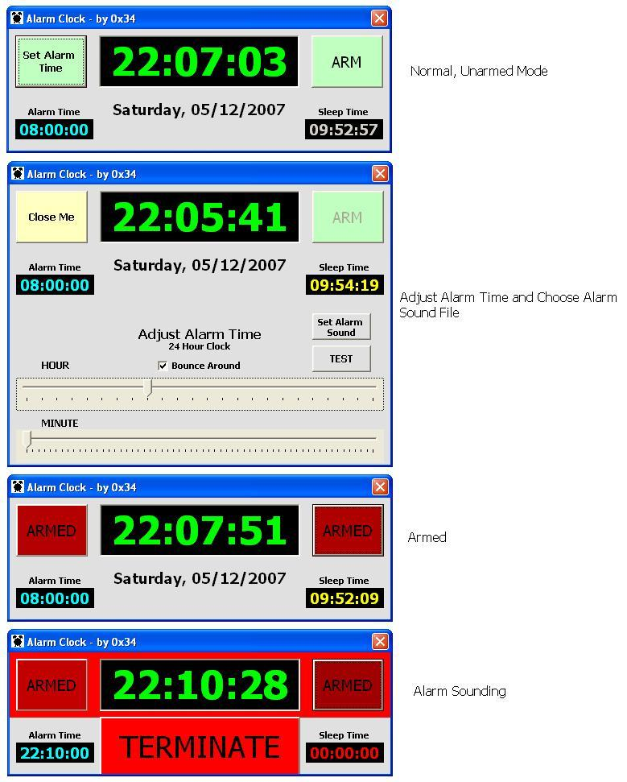



## A 24hr Alarm Clock

### Description

This is a nicely done 24 hour alarm clock. It allows you to select the alarm sound (wav), which it keeps in an ini file. The alarm time is easily set with sliders. It displays Day, Date, Time, Alarm time and Sleep Time (how much time you have to sleep). Several cool &#8220;animation&#8221; tricks.
 
### More Info
 

             |
---                |---
**Submitted On**   |2007-05-12 22:39:16
**By**             |[0x34](https://github.com/Planet-Source-Code/PSCIndex/blob/master/ByAuthor/0x34.md)
**Level**          |Beginner
**User Rating**    |4.8 (24 globes from 5 users)
**Compatibility**  |VB 6\.0
**Category**       |[Miscellaneous](https://github.com/Planet-Source-Code/PSCIndex/blob/master/ByCategory/miscellaneous__1-1.md)
**World**          |[Visual Basic](https://github.com/Planet-Source-Code/PSCIndex/blob/master/ByWorld/visual-basic.md)
**Archive File**   |[A\_24hr\_Ala2065455132007\.zip](https://github.com/Planet-Source-Code/0x34-a-24hr-alarm-clock__1-68586/archive/master.zip)

